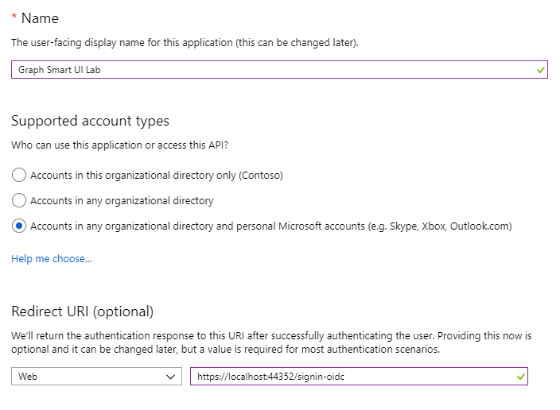
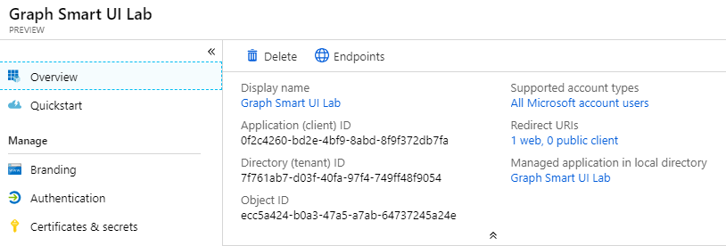
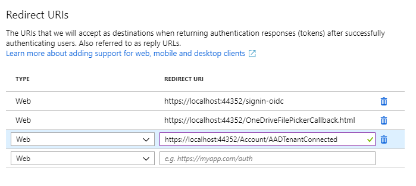
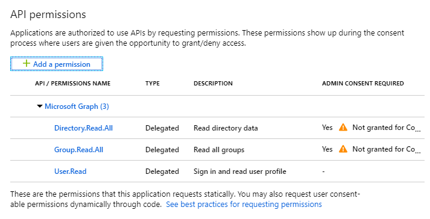
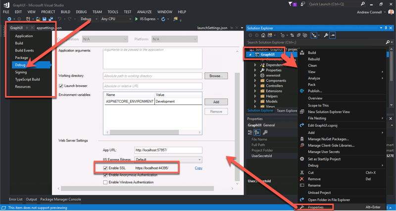

# Demo - Using Office 365 Pickers

In this demo, you will extend an ASP.NET Core application to use pickers provided by Office 365 services.

### Register an application in Azure AD

To enable an application to call the Microsoft Graph, an application registration is required. This lab uses the [Azure Active Directory v2.0 endpoint](https://docs.microsoft.com/en-us/azure/active-directory/develop/active-directory-v2-compare).

1. Open a browser and navigate to the [Azure Active Directory admin center (https://aad.portal.azure.com)](https://aad.portal.azure.com). Login using a **personal account** (aka: Microsoft Account) or **Work or School Account**.

1. Select **Azure Active Directory** in the left-hand navigation, then select **App registrations** under **Manage**.

1. Select **New registration**. On the **Register an application** page, set the values as follows.

    - Set **Name** to **Graph Smart UI Lab**.
    - Set **Supported account types** to **Accounts in any organizational directory and personal Microsoft accounts**.
    - Under **Redirect URI**, set the first drop-down to **Web** and set the value to **https://localhost:44395/signin-oidc**.

    

1. Save your settings by selecting **Register**.

1. On the **Graph Smart UI Lab** page, copy the value of the **Application (client) ID** and the **Directory (tenant) ID** and save them, you will need them in the next steps.

    

1. Select **Authentication** under **Manage**. In the **Redirect URIs** section, add 2 more redirect URIs with the following values:

    - **Type**: **Web**, **Redirect URI**: **https://localhost:44395/OneDriveFilePickerCallback.html**
    - **Type**: **Web**, **Redirect URI**: **https://localhost:44395/Account/AADTenantConnected**

    

1. In the **Advanced settings** section, locate **Implicit grant** and enable **Access tokens** and **ID tokens**, then choose **Save**.

    

1. Select **Certificates & secrets** under **Manage**. Select the **New client secret** button. Enter a value in **Description** and select one of the options for **Expires** and choose **Add**.

1. Copy the client secret value before you leave this page. You will need it in the next step.

    > **Important:** This client secret is never shown again, so make sure you copy it now.

1. Select **API permissions** under **Manage**. Choose **Add a permission**.
1. Select **Microsoft Graph**, then **Delegated permissions**.
1. In the **Select permissions** section, scroll down and select the following permissions:
    1. **Directory.Read.All**
    1. **Group.Read.All**
1. Select **Add permissions**.

    

### Update application configuration

1. Open the starter application. The started application is a Visual Studio solution that can be found at **LabFiles\StarterProject\GraphUI.sln**.
1. Open the **appSettings.json** file.
1. Update the following properties, specifying the values from the app registration process.

    ```json
    "Domain": "[yourdomain.onmicrosoft.com]",
    "TenantId": "[your-tenant-id]",
    "ClientId": "[your-client-id]",
    "ClientSecret": "[your-client-secret]",
    ```

1. Verify in the project properties, debug settings that SSL is enabled and that the url matches the one that you entered as part of the redirect url in the app registration. The url should also match the BaseUrl specified in the **appSettings.json** file.

    ```json
    "BaseUrl": "https://localhost:44395"
    ```

    

### Provide administrative consent to application

1. Press F5 to run the application.
1. When prompted, log in with your Work or School account and grant consent to the application.
1. The application will load the **Permission Required** page. Reading Groups from the tenant requires administrative consent, and must be performed via a specific endpoint. Select the **Connect your tenant** link.

    

1. Log in with an account that has administrative privileges in the tenant.
1. On the administrative consent dialog, select **Accept**.
1. The app will then display the Home page.
1. Stop debugging

### Add the OneDrive File Picker

OneDrive provides File pickers for Android and JavaScript. This lab uses the JavaScript version. Additional information is available on the [reference page](https://docs.microsoft.com/en-us/onedrive/developer/controls/file-pickers/js-v72/).

The File picker requires a control for the user to invoke the picker, and a callback page to receive the requested information from OneDrive. Create the callback page by performing these steps:

1. In Solution Explorer, right-click on the **wwwroot** folder and choose **Add > New Item...**
1. Select the **HTML Page** template. Name file **OneDriveFilePickerCallback.html**.

    

1. Replace the contents of the file the following statements:

    ```html
    <!DOCTYPE html>
    <html lang="en">
      <script type="text/javascript"  src="https://js.live.net/v7.2/OneDrive.js"></script>
    </html>
    ```

1. Save and close the file.
1. Open the file **Views\Picker\Index.cshtml**
1. Notice that line 16 contains a button with a JavaScript handler for the `onClick()` event.
1. At the bottom of the page, approx line 33, is a Razor section named **scripts**. Add the following tag inside the **scripts** section to load the File picker control.

    ```javascript
    <script type="text/javascript" src="https://js.live.net/v7.2/OneDrive.js"></script>
    ```

1. Add the following code after the **OneDrive.js** script tag. (_The code is available in the **LabFiles\Pickers\OneDriveFilePicker.js** file_):

    ```javascript
    <script type="text/javascript">
      function launchOneDrivePicker() {
        var ClientID = "@Options.Value.ClientId";

        var odOptions = {
          clientId: ClientID,
          action: "query",
          multiSelect: false,
          advanced: {
            queryParameters: "select=id,name,size,file,folder,photo,@@microsoft.graph.downloadUrl",
            redirectUri: '@Options.Value.BaseUrl/OneDriveFilePickerCallback.html'
          },
          success: function (files) {
            var data = files;
            var fileName = data.value[0]["name"];
            var filePath = data.value[0]["@@microsoft.graph.downloadUrl"];

            document.getElementById('selectedFileName').innerHTML = '<strong>' + fileName + '</strong>';
            document.getElementById('selectedFileUrl').innerText = filePath.substr(0, filePath.indexOf('tempauth') + 15) + '...';
          },
          cancel: function () {
            /* cancel handler */
          },
          error: function (e) {
            /* error handler */
            alert(e);
          }
        };
        OneDrive.open(odOptions);
      }
    </script>
    ```

1. Run the application by pressing <kbd>F5</kbd>.
1. Select on the **Pickers** link in the left-side navigation.
1. Select the **Select from OneDrive** button.
1. The File picker has a set of permissions that it requires. The app registration performed in this lab does not include those permissions, so you will need to log in and grant consent to your OneDrive for Business library.
1. After consenting, the File picker renders in dialog window.

    

1. Select a file and select **Open**.
1. The File picker will close the dialog and call the `success` callback, passing the requested information.

    

1. Close the browser to stop the debugging session.

### Add the Office UI Fabric People Picker

Office UI Fabric provides a People Picker component written in React. For detailed information about the components, refer to the [Office UI Fabric documentation](http://dev.office.com/fabric). The starter project in the lab is pre-configured to use React, following the principles of the [create-react-app utility](https://reactjs.org/docs/add-react-to-a-new-app.html#create-react-app). In the lab, you will extend the application to use the [sample people picker from Office UI Fabric](https://developer.microsoft.com/en-us/fabric#/components/peoplepicker).

1. In Solution Explorer, right-select on the **Components** folder and choose **Add > New Item...**
1. Select the **TypeScript JSX File** template. Name file **PeoplePickerExampleData.tsx**.
1. Replace the contents of the template with the code from the file **LabFiles\Pickers\PeoplePickerExampleData.tsx**.
1. In Solution Explorer, right-select on the **Components** folder and choose **Add > New Item...**
1. Select the **TypeScript JSX File** template. Name file **PeoplePicker.tsx**.
1. Replace the contents of the template with the code from the file **LabFiles\Pickers\PeoplePicker.tsx**.
1. Open the file **Views\Picker\Index.cshtml**.
1. Notice around line 25 contains a `<div>` with the id `react-peoplePicker`. This is the location in the page in which the control will be rendered.
1. Inside the **scripts** section, add the following line right before the `</script>` tag:

    ```javascript
    App.RenderPeoplePicker();
    ```

1. The `RenderPeoplePicker()` method is defined in the **Components\boot.tsx** file. It needs to be updated now:
    1. Un-comment the following `import` statement at the top of the file for the PeoplePicker:

        ```tsx
        //import { PeoplePicker } from './PeoplePicker';
        ```

    1. Add the following code to the `RenderPeoplePicker()` method:

      ```tsx
      ReactDOM.render(
        <PeoplePicker></PeoplePicker>,
        document.getElementById('react-peoplePicker')
      );
      ```

    >Note: The webpack configuration specifies that the TypeScript in the project is injected into pages as a library object named `App`.

1. Run the application by pressing <kbd>F5</kbd>.
1. Select on the **Pickers** link in the left-side navigation.
1. Notice the People Picker section is now working and displaying a people picker:

    

1. Close the browser to stop the debugging session.
