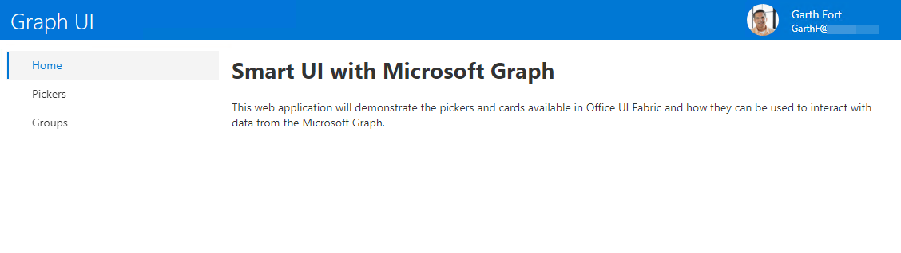
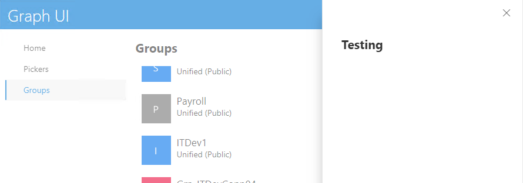
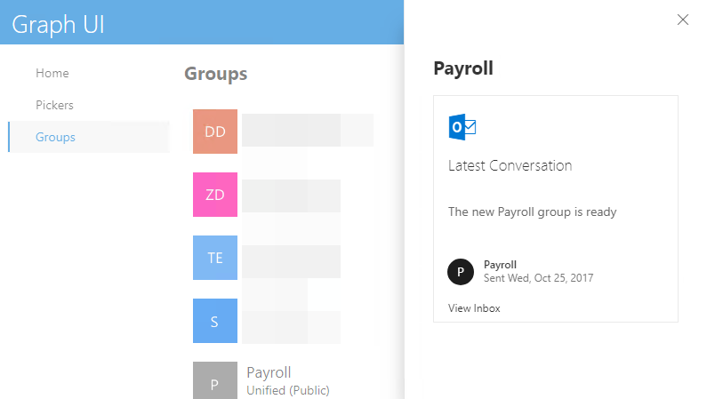
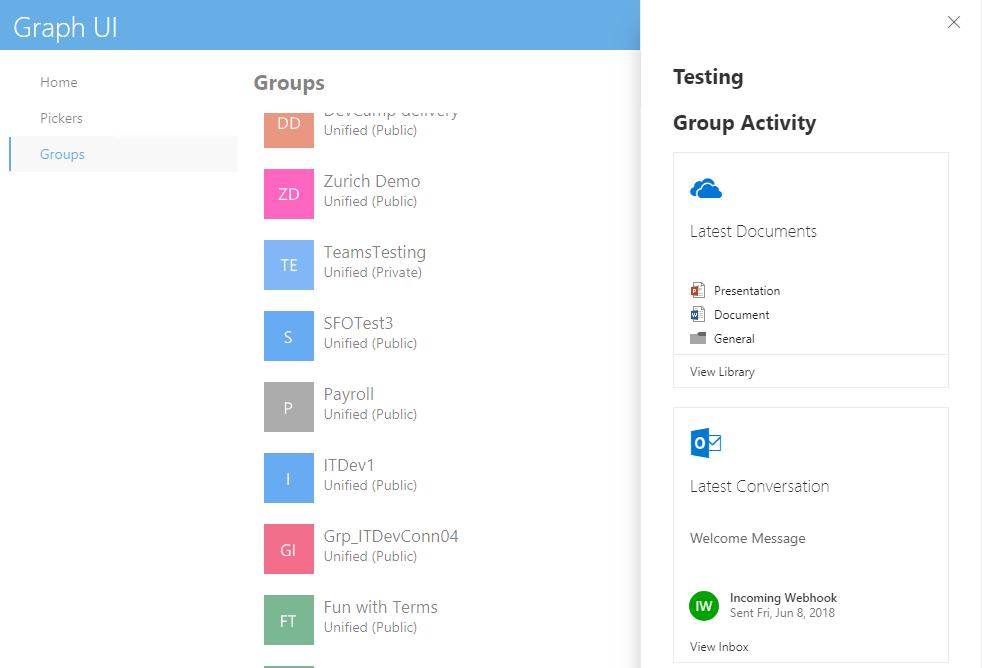

# Demo - Using Office UI Fabric Cards

This demo will add various cards from Office UI Fabric to the application. The application reads Group information and should be run as the tenant administrator.

### Add Persona card to banner

The application has a banner at the top of each page. In this step, add a Persona card to the banner showing the current logged-in user. The complete `Banner` class can be found in the file `LabFiles\Cards\Banner.tsx` file.

1. In Visual Studio, open the file `Components\banner.tsx'.
1. At the top of the file, add the following import statement:

    ```typescript
    import {
      Persona,
      PersonaInitialsColor,
      IPersonaStyles,
      IPersonaStyleProps,
      PersonaSize
    } from 'office-ui-fabric-react/lib/Persona';
    ```

1. In the `banner.tsx` file, locate the `Banner` class. The class has a constructor and a method named `render`. Add the following as a new method in the `Banner` class.

    ```typescript
    private getPersonaStyles(props: IPersonaStyleProps): Partial<IPersonaStyles> {
      return {
        root: {
          color: ColorClassNames.white,
          float: "right"
        },
        textContent: {
          color: ColorClassNames.white
        },
        primaryText: {
          color: ColorClassNames.white
        },
        secondaryText: {
          color: ColorClassNames.white
        }
      };
    }
    ```

1. The name and picture of the current user are written to the page in the `_Layouts.cshtml` file. Add the following to `banner.tsx` to create a Persona component with that information. This statement should be the first line of the `render` method, replacing the existing definition of the persona variable.

    ```typescript
    const persona = (this.props.name) ? (
      <Persona
        size={PersonaSize.size40}
        primaryText={this.props.name}
        secondaryText={this.props.email}
        imageUrl={this.props.imageUrl}
        getStyles={this.getPersonaStyles}
      />
    ) : (
      <span>&nbsp;</span>
    );
    ```

1. Save all files and press F5 to run the project. After login, the home page will show the current user at the top right of the screen.

  

### Add Cards to Groups detail component

The application has a page to display all Office 365 groups in the tenant. Selecting a group opens a Panel with the group title.

1. With the project still running, select the **Groups** link in the left-hand navigation. From the list of Groups, select on a group to open the details pane.

    

In this step, add information about recent group activity using DocumentCards. The complete set of cards for the Group page can be found in the `LabFiles\Cards\GroupDetails.tsx` file.

1. In Visual Studio, open the file `Components\GroupDetails.tsx'.
1. At the top of the file, add the following imports:

    ```typescript
    import {
      DocumentCard,
      DocumentCardActions,
      DocumentCardActivity,
      DocumentCardLocation,
      DocumentCardPreview,
      DocumentCardTitle,
      DocumentCardLogo,
      DocumentCardStatus,
      IDocumentCardPreviewProps,
      IDocumentCardLogoProps,
      DocumentCardType,
      IDocumentCardPreviewImage
    } from 'office-ui-fabric-react/lib/DocumentCard';
    import { ImageFit } from 'office-ui-fabric-react/lib/Image';
    import { Icon, IconType, IIconProps } from 'office-ui-fabric-react/lib/Icon';
    import { initializeFileTypeIcons, getFileTypeIconProps, FileIconType } from '@uifabric/file-type-icons';
    import { GlobalSettings } from 'office-ui-fabric-react/lib/Utilities';
    initializeFileTypeIcons();
    ```

1. In the `GroupDetails` class, create the following method to render the most-recent conversation using a DocumentCard.

    ```typescript
    private getMailboxActivity(latestConversation: Conversation, mailboxWebUrl: string): JSX.Element {
      let mailboxActivity = null;
      if (latestConversation) {
        let activityMessage = `Sent ${latestConversation.lastDelivered}`;
        let people = [];
        for (var i = 0; i < latestConversation.uniqueSenders.length; i++) {
          people.push({ name: latestConversation.uniqueSenders[i] });
        }
        mailboxActivity = (
          <DocumentCard>
            <DocumentCardLogo logoIcon='OutlookLogo' />
            <DocumentCardTitle title='Latest Conversation' shouldTruncate={true} />
            <DocumentCardTitle title={latestConversation.topic} shouldTruncate={true} showAsSecondaryTitle={true} />
            <DocumentCardActivity
              activity={activityMessage}
              people={people}
            />
            <DocumentCardLocation location='View Inbox' locationHref={mailboxWebUrl} ariaLabel='Group inbox' />
          </DocumentCard>
        );
      }
      return mailboxActivity;
    }
    ```

1. In the `render` method of the `GroupDetails` class, replace the `return` statement with the following:

    ```typescript
    return (
      <div>
        <h2>{group.name}</h2>
        { this.getMailboxActivity(group.latestConversation, group.mailboxWebUrl) }
      </div>
    );
    ```

1. Save the file.
1. Refresh the Groups page and select on a group. The detail panel will include details about the latest conversation.

    

1. Return to Visual Studio. In the `GroupDetails` class, create the following method to render the most-recently updated documents in the Group library.

    ```typescript
    private getLibraryActivity(driveRecentItems: DriveItem[], driveWebUrl: string): JSX.Element {
      if (driveRecentItems == null || driveRecentItems.length == 0) {
        return null;
      }

      let libraryActivity: JSX.Element = null;

      let globalSettings = (window as any).__globalSettings__;

      let recentDocs: IDocumentCardPreviewProps = {
        getOverflowDocumentCountText: (overflowCount: number) => `+${overflowCount} more`,
        previewImages: [ ]
      };

      let documentCardDocTitle: JSX.Element = null;

      if (driveRecentItems.length == 1) {
        const doc = driveRecentItems[0];
        let iconProps: IIconProps = this.getIconProps((doc.fileType));
        let previewImage: IDocumentCardPreviewImage = {
          name: doc.title,
          url: doc.webUrl,
          previewImageSrc: doc.thumbnailUrl,
          iconSrc: globalSettings.icons[iconProps.iconName].code.props.src
        };
        recentDocs.previewImages.push(previewImage);
        documentCardDocTitle = <DocumentCardTitle title={doc.title} shouldTruncate={true} />;
      }
      else {
        let docs = this.props.group.driveRecentItems;
        for (var i = 0; i < docs.length; i++) {
          let iconProps: IIconProps = this.getIconProps((doc.fileType));
          let previewImage: IDocumentCardPreviewImage = {
            name: docs[i].title,
            url: docs[i].webUrl,
            iconSrc: globalSettings.icons[iconProps.iconName].code.props.src
          };
          recentDocs.previewImages.push(previewImage);
        }
      }

      libraryActivity = (
        <DocumentCard>
          <DocumentCardLogo logoIcon='OneDrive' />
          <DocumentCardTitle title='Latest Documents' />
          <DocumentCardPreview previewImages={recentDocs.previewImages} getOverflowDocumentCountText={recentDocs.getOverflowDocumentCountText} />
          {documentCardDocTitle}
          <DocumentCardLocation location='View Library' locationHref={driveWebUrl} />
        </DocumentCard>
      );

      return libraryActivity;
    }

    private getIconProps(fileSuffix: string): IIconProps {
      let iconProps: IIconProps = {};
      switch (fileSuffix) {
        case "folder":
          iconProps = getFileTypeIconProps({ type: FileIconType.folder, size: 16 });
          break;
        default:
          iconProps = getFileTypeIconProps({ extension: fileSuffix, size: 16 });
          break;
      }
      return iconProps;
    }
    ```

1. Replace the `render` method with the following.

    ```typescript
    public render() {
      const group = this.props.group;

      const libraryActivity: JSX.Element = this.getLibraryActivity(group.driveRecentItems, group.driveWebUrl);
      const mailboxActivity: JSX.Element = this.getMailboxActivity(group.latestConversation, group.mailboxWebUrl);

      const activity = (libraryActivity || mailboxActivity) ? (
        <div>
          <h2>Group Activity</h2>
          {libraryActivity}
          <br />
          {mailboxActivity}
        </div>
      ) : (null);

      return (
        <div>
          <h2>{group.name}</h2>
          { activity }
        </div>
      );
    }
    ```

1. Save the file.
1. Refresh the Groups page and select on a group. The detail panel will include details about the latest documents in the group library (if any).

    
