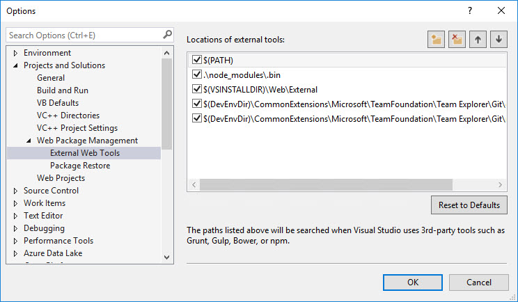
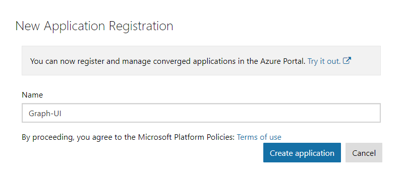
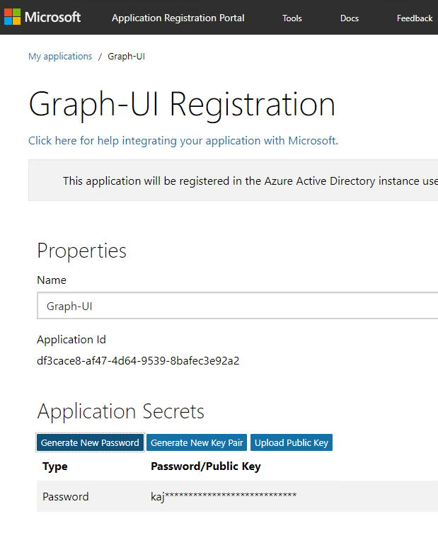
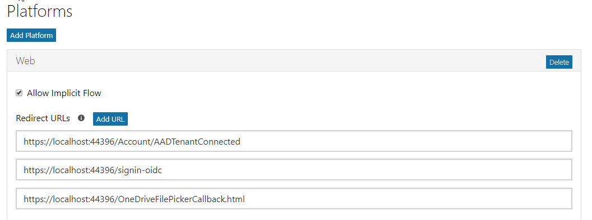
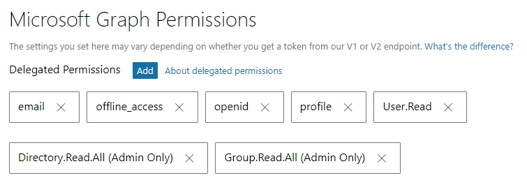
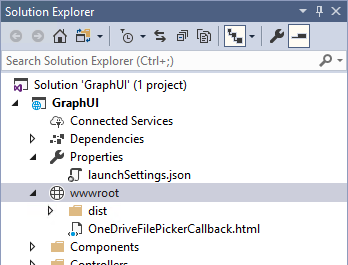
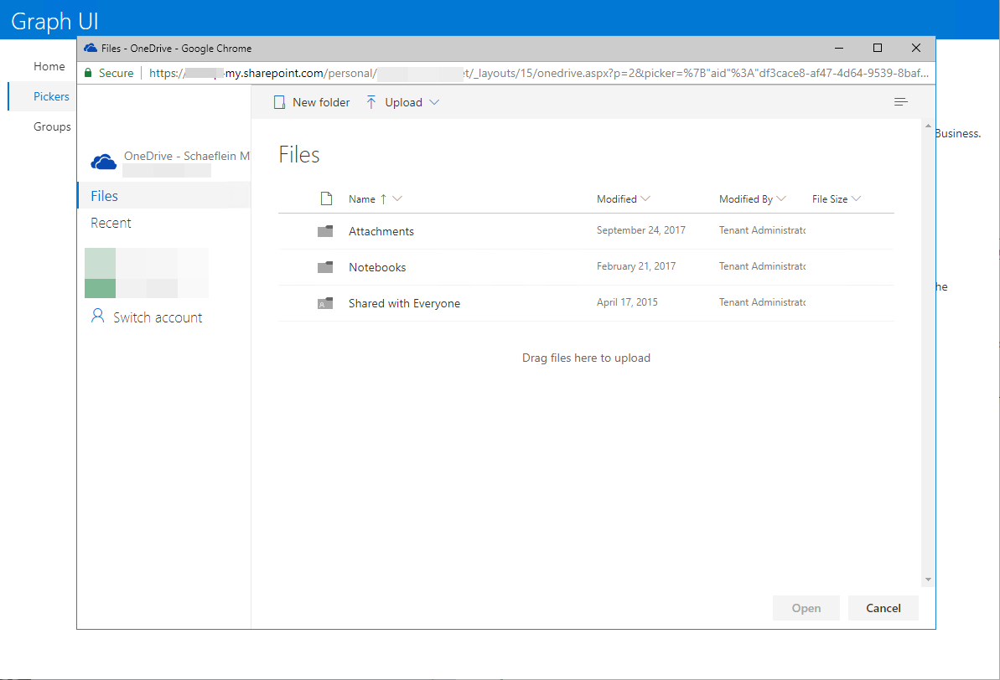
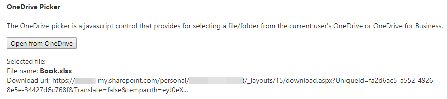
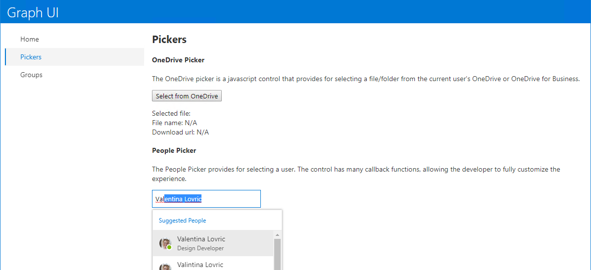
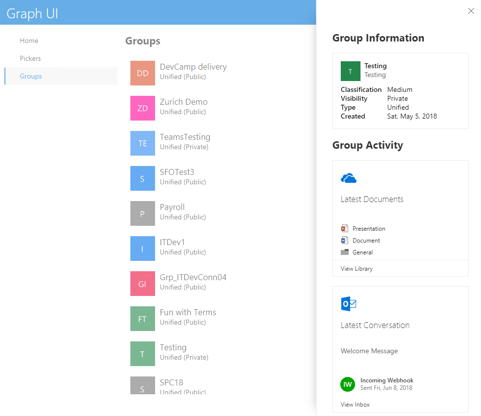

# Lab: Smart UI with Microsoft Graph, Pickers and Cards

In this lab, you will walk through building a web user interface with Office UI Fabric components and invoking Office 365 pickers for interacting with data from the Microsoft Graph.

## In this lab

1. [Exercise 1: Using Office 365 Pickers](#exercise-1-using-office-365-pickers)
1. [Exercise 2: Using Office UI Fabric Cards](#exercise-2-using-office-ui-fabric-cards)
1. [Exercise 3: Render an Adaptive Card with data from Microsoft Graph](#exercise-3-using-adaptive-cards)

## Prerequisites

This lab will require an Office 365 tenant and a user account with the ability to grant administrative consent in the tenant.

### Install developer tools

The developer workstation requires the following tools for this lab.

#### NodeJS

Install [NodeJS](https://nodejs.org/en/) Long Term Support (LTS) version.

- If you have NodeJS already installed please check you have the latest version using node -v. It should return the current [LTS version](https://nodejs.org/en/download/).

After installing node, make sure npm is up to date by running following command:

```shell
npm install -g npm
```

Configure Visual Studio to use the NodeJS version you installed instead of the version included in the Visual Studio install:

1. Select **Tools > Options**.
1. Expand **Projects and Solutions > Web Package Management**.
1. Select on **External Web Tools**.
1. Select the entry **$(PATH)**.
1. Select the up arrow to make this entry first in the list.



#### NPM Task Runner for Visual Studio

Install [NPM task runner](https://marketplace.visualstudio.com/items?itemName=MadsKristensen.NPMTaskRunner)

#### Azure Active Directory (Azure AD) Tenant Id

The application created in this lab requires the id of the tenant in which the application is registered. Use the support article [Find your Office 365 tenant ID](https://support.office.com/en-us/article/find-your-office-365-tenant-id-6891b561-a52d-4ade-9f39-b492285e2c9b) to obtain the id.

## Exercise 1: Using Office 365 Pickers

In this exercise, you will extend an ASP.NET Core application to use pickers provided by Office 365 services.

### Register an application in Azure AD

To enable an application to call the Microsoft Graph, an application registration is required. This lab uses the [Azure Active Directory v2.0 endpoint](https://docs.microsoft.com/en-us/azure/active-directory/develop/active-directory-v2-compare).

1. Open a browser to the url **<https://apps.dev.microsoft.com>**
1. Log in with a Work or School account.
1. Select **Add an app**
1. Complete the **Register your application** section, entering an Application name. Clear the checkbox for Guided Setup. Select **Create**

    

1. On the registration page, in the **Application Secrets** section, select **Generate New Password**. Copy the generated password for future use.

    

1. On the registration page, in the **Platforms** section, select **Add Platform**.
1. In the **Add Platform** dialog, select **Web**.
1. Enter a **Redirect URL** to the callback page file. For this lab, use the value `https://localhost:44352/OneDriveFilePickerCallback.html`

1. Select the **Add URL** button.
1. Enter a **Redirect URL** for the implicit flow callback. For this lab, use the value `https://localhost:44352/signin-oidc`
1. Select the **Add URL** button again.
1. Enter a **Redirect URL** for the admin consent callback. For this lab, use the value `https://localhost:44352/Account/AADTenantConnected`

    

1. Select **Save**.
1. Make note of the Application Id. This value is used in the authentication / token code.
1. Scroll down to the **Microsoft Graph Permissions** section.
1. Next to **Delegated Permissions**, select the **Add** button.
1. In the **Select Permission** dialog, scroll down and select the following Scopes:
    1. **Directory.Read.All**
    1. **email**
    1. **Group.Read.All**
    1. **offline_access**
    1. **openid**
    1. **profile**
1. Select **OK**.

    

1. Select **Save**.

### Update application configuration

1. Open the starter application. The started application is a Visual Studio solution that can be found at `LabFiles\StarterProject\GraphUI.sln`.
1. Open the `appSettings.json` file.
1. Update the following properties, specifying the values from the app registration process.

    ```json
    "Domain": "[yourdomain.onmicrosoft.com]",
    "TenantId": "[your-tenant-id]",
    "ClientId": "[your-client-id]",
    "ClientSecret": "[your-client-secret]",
    ```
1. Verify in the project properties, debug settings that SSL is enabled and that the url matches the one that you entered as part of the redirect url in the app registration. The url should also match the BaseUrl specified in the `appSettings.json` file.

    ```json
    "BaseUrl": "https://localhost:44352"
    ```

### Provide administrative consent to application

1. Press F5 to run the application.
1. When prompted, log in with your Work or School account and grant consent to the application.
1. The application will load the **Permission Required** page. Reading Groups from the tenant requires administrative consent, and must be performed via a specific endpoint. Select the **Connect your tenant** link.
1. Log in with an account that has administrative privileges in the tenant.
1. On the administrative consent dialog, select **Accept**.
1. The app will then display the Home page.
1. Stop debugging

### Add the OneDrive File Picker

OneDrive provides File pickers for Android and JavaScript. This lab uses the JavaScript version. Additional information is available on the [reference page](https://docs.microsoft.com/en-us/onedrive/developer/controls/file-pickers/js-v72/).

The File picker requires a control for the user to invoke the picker, and a callback page to receive the requested information from OneDrive. Create the callback page by performing these steps:

1. In Solution Explorer, right-select on the **wwwroot** folder and choose **Add > New Item...**
1. Select the **HTML Page** template. Name file `OneDriveFilePickerCallback.html`

    

1. Replace the contents of the file the following statements:

    ```html
    <!DOCTYPE html>
    <html lang="en">
      <script type="text/javascript"  src="https://js.live.net/v7.2/OneDrive.js"></script>
    </html>
    ```

1. Save and close the file.
1. Open the file `Views\Picker\Index.cshtml`
1. Notice that line 16 contains a button with a JavaScript handler for the select event.
1. At the bottom of the page, approx line 33, is a Razor section named **scripts**. Add the following tag inside the **scripts** section to load the File picker control.

    ```javascript
    <script type="text/javascript" src="https://js.live.net/v7.2/OneDrive.js"></script>
    ```

1. Add the following code after the `OneDrive.js` script tag. (The code is available in the `LabFiles\Pickers\OneDriveFilePicker.js` file):

    ```javascript
    <script type="text/javascript">
      function launchOneDrivePicker() {
        var ClientID = "@Options.Value.ClientId";

        var odOptions = {
          clientId: ClientID,
          action: "query",
          multiSelect: false,
          advanced: {
            queryParameters: "select=id,name,size,file,folder,photo,@@microsoft.graph.downloadUrl",
            redirectUri: '@Options.Value.BaseUrl/OneDriveFilePickerCallback.html'
          },
          success: function (files) {
            var data = files;
            var fileName = data.value[0]["name"];
            var filePath = data.value[0]["@@microsoft.graph.downloadUrl"];

            document.getElementById('selectedFileName').innerHTML = '<strong>' + fileName + '</strong>';
            document.getElementById('selectedFileUrl').innerText = filePath.substr(0, filePath.indexOf('tempauth') + 15) + '...';
          },
          cancel: function () {
            /* cancel handler */
          },
          error: function (e) {
            /* error handler */
            alert(e);
          }
        };
        OneDrive.open(odOptions);
      }
    </script>
    ```

1. Run the application.
1. Select on the **Pickers** link in the left-side navigation.
1. Select the **Select from OneDrive** button.
1. The File picker has a set of permissions that it requires. The app registration performed in this lab does not include those permissions, so you will need to log in and grant consent to your OneDrive for Business library.
1. After consenting, the File picker renders in dialog window.

    

1. Select a file and select **Open**.
1. The File picker will close the dialog and call the `success` callback, passing the requested information.

    

### Add the Office UI Fabric People Picker

Office UI Fabric provides a People Picker component written in React. For detailed information about the components, refer to the [Office UI Fabric documentation](http://dev.office.com/fabric). The starter project in the lab is pre-configured to use React, following the principles of the [create-react-app utility](https://reactjs.org/docs/add-react-to-a-new-app.html#create-react-app). In the lab, you will extend the application to use the [sample people picker from Office UI Fabric](https://developer.microsoft.com/en-us/fabric#/components/peoplepicker).

1. In Solution Explorer, right-select on the **Components** folder and choose **Add > New Item...**
1. Select the **TypeScript JSX File** template. Name file `PeoplePickerExampleData.tsx`.
1. Replace the contents of the template with the code from the file `LabFiles\Pickers\PeoplePickerExampleData.tsx`.
1. In Solution Explorer, right-select on the **Components** folder and choose **Add > New Item...**
1. Select the **TypeScript JSX File** template. Name file `PeoplePicker.tsx`.
1. Replace the contents of the template with the code from the file `LabFiles\Pickers\PeoplePicker.tsx`.
1. Open the file `Views\Picker\Index.cshtml`
1. Notice that line 29 contains a div with the id `react-peoplePicker`. This is the location in the page in which the control will be rendered.
1. Inside the **scripts** section, add the following line right before the `</script>` tag:

    ```javascript
    App.RenderPeoplePicker();
    ```
1. The `RenderPeoplePicker` method is defined in the `Components\boot.tsx` file. Un-comment the import statement at the top of the file for the PeoplePicker and add the following code to that method:

    ```javascript
    ReactDOM.render(
      <PeoplePicker></PeoplePicker>,
      document.getElementById('react-peoplePicker')
    );
    ```

    >Note: The webpack configuration specifies that the TypeScript in the project is injected into pages as a library object named `App`.

    

## Exercise 2: Using Office UI Fabric Cards

This exercise will add various cards from Office UI Fabric to the application. The application reads Group information and should be run as the tenant administrator.

### Add Persona card to banner

The application has a banner at the top of each page. In this step, add a Persona card to the banner showing the current logged-in user. The complete `Banner` class can be found in the file `LabFiles\Cards\Banner.tsx` file.

1. In Visual Studio, open the file `Components\banner.tsx'.
1. At the top of the file, add the following import statement:

    ```typescript
    import {
      Persona,
      PersonaInitialsColor,
      IPersonaStyles,
      IPersonaStyleProps,
      PersonaSize
    } from 'office-ui-fabric-react/lib/Persona';
    ```

1. In the `banner.tsx` file, locate the `Banner` class. The class has a constructor and a method named `render`. Add the following as a new method in the `Banner` class.

    ```typescript
    private getPersonaStyles(props: IPersonaStyleProps): Partial<IPersonaStyles> {
      return {
        root: {
          color: ColorClassNames.white,
          float: "right"
        },
        textContent: {
          color: ColorClassNames.white
        },
        primaryText: {
          color: ColorClassNames.white
        },
        secondaryText: {
          color: ColorClassNames.white
        }
      };
    }
    ```

1. The name and picture of the current user are written to the page in the `_Layouts.cshtml` file. Add the following to `banner.tsx` to create a Persona component with that information. This statement should be the first line of the `render` method, replacing the existing definition of the persona variable.

    ```typescript
    const persona = (this.props.name) ? (
      <Persona
        size={PersonaSize.size40}
        primaryText={this.props.name}
        secondaryText={this.props.email}
        imageUrl={this.props.imageUrl}
        getStyles={this.getPersonaStyles}
      />
    ) : (
      <span>&nbsp;</span>
    );
    ```

1. Save all files and press F5 to run the project. After login, the home page will show the current user at the top right of the screen.

  

### Add Cards to Groups detail component

The application has a page to display all Office 365 groups in the tenant. Selecting a group opens a Panel with the group title.

1. With the project still running, select the **Groups** link in the left-hand navigation. From the list of Groups, select on a group to open the details pane.

    

In this step, add information about recent group activity using DocumentCards. The complete set of cards for the Group page can be found in the `LabFiles\Cards\GroupDetails.tsx` file.

1. In Visual Studio, open the file `Components\GroupDetails.tsx'.
1. At the top of the file, add the following imports:

    ```typescript
    import {
      DocumentCard,
      DocumentCardActions,
      DocumentCardActivity,
      DocumentCardLocation,
      DocumentCardPreview,
      DocumentCardTitle,
      DocumentCardLogo,
      DocumentCardStatus,
      IDocumentCardPreviewProps,
      IDocumentCardLogoProps,
      DocumentCardType,
      IDocumentCardPreviewImage
    } from 'office-ui-fabric-react/lib/DocumentCard';
    import { ImageFit } from 'office-ui-fabric-react/lib/Image';
    import { Icon, IconType, IIconProps } from 'office-ui-fabric-react/lib/Icon';
    import { initializeFileTypeIcons, getFileTypeIconProps, FileIconType } from '@uifabric/file-type-icons';
    import { GlobalSettings } from 'office-ui-fabric-react/lib/Utilities';
    import Conversation = GroupList.Conversation;
    initializeFileTypeIcons();
    ```

1. In the `GroupDetails` class, create the following method to render the most-recent conversation using a DocumentCard.

    ```tsx
    private getMailboxActivity(latestConversation: Conversation, mailboxWebUrl: string): JSX.Element {
      let mailboxActivity = null;
      if (latestConversation) {
        let activityMessage = `Sent ${latestConversation.lastDelivered}`;
        let people = [];
        for (var i = 0; i < latestConversation.uniqueSenders.length; i++) {
          people.push({ name: latestConversation.uniqueSenders[i] });
        }
        mailboxActivity = (
          <DocumentCard>
            <DocumentCardLogo logoIcon='OutlookLogo' />
            <DocumentCardTitle title='Latest Conversation' shouldTruncate={true} />
            <DocumentCardTitle title={latestConversation.topic} shouldTruncate={true} showAsSecondaryTitle={true} />
            <DocumentCardActivity
              activity={activityMessage}
              people={people}
            />
            <DocumentCardLocation location='View Inbox' locationHref={mailboxWebUrl} ariaLabel='Group inbox' />
          </DocumentCard>
        );
      }
      return mailboxActivity;
    }
    ```

1. In the `render` method of the `GroupDetails` class, replace the `return` statement with the following:

    ```tsx
    return (
      <div>
        <h2>{this.props.group.name}</h2>
        { this.getMailboxActivity(this.props.group.latestConversation, this.props.group.mailboxWebUrl) }
      </div>
    );
    ```

1. Save the file.
1. Refresh the Groups page and select on a group. The detail panel will include details about the latest conversation.

    

1. Return to Visual Studio. In the `GroupDetails` class, create the following method to render the most-recently updated documents in the Group library.

    ```tsx
    private getLibraryActivity(driveRecentItems: DriveItem[]): JSX.Element {
      if (driveRecentItems == null || driveRecentItems.length == 0) {
        return null;
      }

      let libraryActivity: JSX.Element = null;

      let globalSettings = (window as any).__globalSettings__;

      let recentDocs: IDocumentCardPreviewProps = {
        getOverflowDocumentCountText: (overflowCount: number) => `+${overflowCount} more`,
        previewImages: [
        ]
      };

      let documentCardDocTitle: JSX.Element = null;

      if (driveRecentItems.length == 1) {
        const doc = driveRecentItems[0];
        let iconProps: IIconProps = this.getIconProps((doc.fileType));
        let previewImage: IDocumentCardPreviewImage = {
          name: doc.title,
          url: doc.webUrl,
          previewImageSrc: doc.thumbnailUrl,
          iconSrc: globalSettings.icons[iconProps.iconName].code.props.src   // hack for file-type-icons
        };
        recentDocs.previewImages.push(previewImage);
        documentCardDocTitle = <DocumentCardTitle title={doc.title} shouldTruncate={true} />;
      } else {
        let docs = this.props.group.driveRecentItems;
        for (var i = 0; i < docs.length; i++) {
          let iconProps: IIconProps = {};
          switch (docs[i].fileType) {
            case "folder":
              iconProps = getFileTypeIconProps({ type: FileIconType.folder, size: 16 });
              break;
            default:
              iconProps = getFileTypeIconProps({ extension: docs[i].fileType, size: 16 });
              break;
          }

          let previewImage: IDocumentCardPreviewImage = {
            name: docs[i].title,
            url: docs[i].webUrl,
            iconSrc: globalSettings.icons[iconProps.iconName].code.props.src   // hack for file-type-icons
          };
          recentDocs.previewImages.push(previewImage);
        }
      }

      libraryActivity = (
        <DocumentCard>
          <DocumentCardLogo logoIcon='OneDrive' />
          <DocumentCardTitle title='Latest Documents' />
          <DocumentCardPreview previewImages={recentDocs.previewImages} getOverflowDocumentCountText={recentDocs.getOverflowDocumentCountText} />
          {documentCardDocTitle}
          <DocumentCardLocation location='View Library' locationHref={this.props.group.driveWebUrl} />
        </DocumentCard>
      );

      return libraryActivity;
    }

    private getIconProps(fileSuffix: string): IIconProps {
      let iconProps: IIconProps = {};

      switch (fileSuffix) {
        case "folder":
          iconProps = getFileTypeIconProps({ type: FileIconType.folder, size: 16 });
          break;
        default:
          iconProps = getFileTypeIconProps({ extension: fileSuffix, size: 16 });
          break;
      }
      return iconProps;
    }
    ```

1. Replace the `render` method with the following.

    ```tsx
    public render() {
      const group = this.props.group;

      const libraryActivity: JSX.Element = this.getLibraryActivity(this.props.group.driveRecentItems);
      const mailboxActivity: JSX.Element = this.getMailboxActivity(this.props.group.latestConversation, this.props.group.mailboxWebUrl);

      const activity = (libraryActivity || mailboxActivity) ? (
          <div>
              <h2>Group Activity</h2>
              {libraryActivity}
              <br />
              {mailboxActivity}
          </div>
      ) : (null);

      return (
          <div>
              <h2>{group.name}</h2>
              { activity }
          </div>
      );
    }
    ```

1. Save the file.
1. Refresh the Groups page and select on a group. The detail panel will include details about the latest documents in the group library (if any).

    

## Exercise 3: Using Adaptive Cards

This exercise will use an Adaptive Card to render Group information.

1. If the Visual Studio debugger is running, stop it.
1. Open the file `Controllers\GroupDataController.cs`
1. Locate the `CreateGroupCard` method. It is currently a stub returning an empty card.
1. Replace the contents of the `CreateGroupCard` method with the following. (The full **CreateGroupCard** method is in the file `LabFiles\Cards\Groups\CreateGroupCard.cs`).

    ```csharp
    private AdaptiveCard CreateGroupCard(Models.GroupModel group)
    {
        AdaptiveCard groupCard = new AdaptiveCard()
        {
            Type = "AdaptiveCard",
            Version = "1.0"
        };

        AdaptiveContainer infoContainer = new AdaptiveContainer();
        AdaptiveColumnSet infoColSet = new AdaptiveColumnSet();

        bool noPic = String.IsNullOrEmpty(group.Thumbnail);

        if (!noPic)
        {
            AdaptiveColumn picCol = new AdaptiveColumn() {Width = AdaptiveColumnWidth.Auto};
            picCol.Items.Add(new AdaptiveImage()
            {
                Url = new Uri(group.Thumbnail),
                Size = AdaptiveImageSize.Small,
                Style = AdaptiveImageStyle.Default
            });
            infoColSet.Columns.Add(picCol);
        }

        AdaptiveColumn txtCol = new AdaptiveColumn() {Width = AdaptiveColumnWidth.Stretch};
        var titleBlock =
            new AdaptiveTextBlock() {Text = NullSafeString(group.Name), Weight = AdaptiveTextWeight.Bolder};
        if (noPic)
        {
            titleBlock.Size = AdaptiveTextSize.Large;
        }

        txtCol.Items.Add(titleBlock);

        txtCol.Items.Add(new AdaptiveTextBlock()
        {
            Text = NullSafeString(group.Description),
            Spacing = AdaptiveSpacing.None,
            IsSubtle = true
        });
        infoColSet.Columns.Add(txtCol);
        infoContainer.Items.Add(infoColSet);

        groupCard.Body.Add(infoContainer);

        AdaptiveContainer factContainer = new AdaptiveContainer();
        AdaptiveFactSet factSet = new AdaptiveFactSet();

        if (!String.IsNullOrEmpty(group.Classification))
        {
            factSet.Facts.Add(new AdaptiveFact()
            {
                Title = "Classification",
                Value = group.Classification
            });
        }

        if (!String.IsNullOrEmpty(group.Visibility))
        {
            factSet.Facts.Add(new AdaptiveFact()
            {
                Title = "Visibility",
                Value = group.Visibility
            });
        }

        if (!String.IsNullOrEmpty(group.GroupType))
        {
            factSet.Facts.Add(new AdaptiveFact()
            {
                Title = "Type",
                Value = NullSafeString(group.GroupType)
            });
        }

        if (group.CreatedDateTime.HasValue)
        {
            factSet.Facts.Add(new AdaptiveFact()
            {
                Title = "Created",
                Value =
                    $"{{{{DATE({group.CreatedDateTime.Value.UtcDateTime.ToString("yyyy-MM-ddTHH:mm:ssZ")},SHORT)}}}}"
            });

        }

        if (!String.IsNullOrEmpty(group.Policy) && group.RenewedDateTime.HasValue)
        {

            factSet.Facts.Add(new AdaptiveFact()
            {
                Title = "Policy",
                Value = NullSafeString(group.Policy)
            });
            factSet.Facts.Add(new AdaptiveFact()
            {
                Title = "Renewed",
                Value =
                    $"{{{{DATE({group.RenewedDateTime.Value.UtcDateTime.ToString("yyyy-MM-ddTHH:mm:ssZ")},SHORT)}}}}"
            });
        }

        factContainer.Items.Add(factSet);
        groupCard.Body.Add(factContainer);

        return groupCard;
    }

    ```

1. In Solution Explorer, right-select on the **Components** folder and choose **Add > New Item...**
1. Select the **SCSS Style Sheet (SASS)** template. Name file `GroupCard.scss`.
1. Replace the contents of the template with the code from the file `LabFiles\Cards\Groups\GroupCard.scss`.
1. In Solution Explorer, right-select on the **Components** folder and choose **Add > New Item...**
1. Select the **TypeScript JSX File** template. Name file `GroupCard.tsx`.
1. Replace the contents of the template with the following. (The complete code for the `GroupCard` class is in the file `LabFiles\Cards\Groups\GroupCard.tsx`.)

    ```tsx
    import * as React from 'react';
    import * as AdaptiveCards from "adaptivecards";
    import { IGroupDetailsProps } from './GroupDetails';
    import './GroupCard.scss';

    export class GroupCard extends React.Component<IGroupDetailsProps, any> {
      constructor(props: IGroupDetailsProps) {
        super(props);
      }

      render() {
        let card = "";
        if (this.props.group.infoCard) {
          card = this.renderAdaptiveCard(this.props.group.infoCard);
        }
        return <div className="groupCard" dangerouslySetInnerHTML={{
          __html: card
        }} >
        </div>
      }

      private renderAdaptiveCard(card: any) {
        // Create an AdaptiveCard instance
        var adaptiveCard = new AdaptiveCards.AdaptiveCard();

        // Set its hostConfig property unless you want to use the default Host Config
        // Host Config defines the style and behavior of a card
        adaptiveCard.hostConfig = new AdaptiveCards.HostConfig({
          fontFamily: "Segoe UI, Helvetica Neue, sans-serif"
        });

        // Parse the card payload
        adaptiveCard.parse(card);

        // Render the card to an HTML element:
        var renderedCard = adaptiveCard.render();
        return renderedCard.innerHTML;
      }
    }
    ```

1. Open the file `Components\GroupDetails.tsx`
1. At the top of the file, add the following import statement.

    ```typescript
    import { GroupCard } from './GroupCard';
    ```

1. In the `render` method, locate the `return` statement. Modify the return statement to include the **GroupCard**.

    ```tsx
    return (
      <div>
        <h2>Group Information</h2>
        <DocumentCard>
          <GroupCard group={this.props.group} />
        </DocumentCard>
        {activity}
      </div>
    );
    ```

1. Save all files.
1. Press F5 to run the application. Navigate to the Groups page and select on a group. The detail panel will include details about group in addition to the activity.

    
